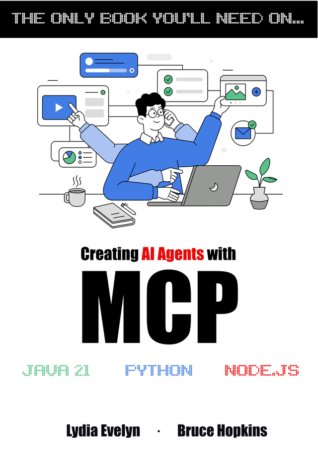

# Create AI Agents with Model Context Protocol (MCP) - O'Reilly Live Training

## 📚 **Complete Guide: Creating AI Agents with MCP - Model Context Protocol**


Create AI Agents with Model Context Protocol (MCP)
O'Reilly Live Training Course Repository

<p align="center">
  <a href="https://leanpub.com/mcp">
    
  </a>
</p>


📚 Get the Book: Creating AI Agents with MCP
The Only Book You'll Need on Model Context Protocol

🎓 O'Reilly Live Training Course
Instructor: Bruce Hopkins
</div>
📖 About This Repository
This repository contains all the code examples, exercises, and materials for the O'Reilly Live Training course "Create AI Agents with Model Context Protocol (MCP)". The course provides hands-on experience building AI agents that leverage the MCP protocol to connect with external tools and data sources.
🚀 What You'll Learn

MCP Fundamentals: Understanding the Model Context Protocol architecture and its role in AI agent development
Building MCP Servers: Creating servers that expose tools, resources, prompts, and sampling capabilities
MCP Client Development: Implementing clients using various SDKs (Python, Java, Node.js)
AI Agent Integration: Connecting MCP with popular AI platforms (Claude Desktop, Cursor, VS Code)
Production Best Practices: Security, performance optimization, and deployment strategies
Real-World Applications: Building practical agents for data analysis, automation, and tool integration

**Get the comprehensive book that goes beyond this course!**

### [📖 Creating AI Agents with MCP - Model Context Protocol](https://leanpub.com/mcp)

**The first and only book you'll need on MCP** - Available now on Leanpub!

This book is part of the "The Only Book You'll Need On..." series and provides complete coverage of the Model Context Protocol with examples in **Python, Java 21, and Node.js** - making it accessible to over 30 million developers worldwide.

**What makes this book unique:**
- 🌍 **Multi-language support**: Full working examples in Python, Java 21, and Node.js
- 🏢 **Enterprise-ready**: Solutions for major enterprises, nimble startups, and career advancement
- 🚀 **Complete implementations**: Get your projects off the ground quickly with full working examples
- 🔄 **Free updates**: DRM-free with lifetime updates as the MCP standard evolves

[**→ Get the book now on Leanpub**](https://leanpub.com/mcp)

---

## 🎯 Course Overview

Welcome to the repository for the O'Reilly Live Training: **"Create AI Agents with Model Context Protocol (MCP)"**. This hands-on course provides developers with practical experience in building AI agents that leverage the emerging MCP standard - the protocol that's becoming the HTTP of AI agent communication.

### 🔗 Course Details
- **Course Link**: [O'Reilly Live Training](https://www.oreilly.com/live-events/create-ai-agents-with-model-context-protocol-mcp/0642572196868/0642572196851/)
- **Instructor**: Bruce Hopkins (Intel Software Innovator for AI & Oracle Java Champion)
- **Duration**: 4 hours of hands-on learning
- **Format**: Live online training with interactive demos

## 🌟 Why MCP Matters

Just as HTTP standardized web client-server communication and FTP standardized file transfer, **Model Context Protocol (MCP) is the emerging standard for AI agent communication**. This open protocol, supported by both OpenAI and Anthropic, enables:

- **Universal Connectivity**: Single clients can access any MCP-compliant agent
- **Dynamic Discovery**: Clients can discover and use new capabilities beyond their original design
- **Secure Integration**: Two-way connections between data sources and AI-powered tools
- **Enterprise Scalability**: Access to corporate, confidential, and personal data sources

## 🎓 What You'll Learn

### Core MCP Concepts (30 minutes)
- **MCP Architecture and Core Concepts**: Understanding the protocol's foundation
- **Business Impact**: Why MCP is crucial for modern AI development
- **Industry Adoption**: Current support from OpenAI, Anthropic, and other major players

### Anthropic Claude Integration (60 minutes)
- **Local File Access**: Leverage MCP for secure file system operations
- **Configuration Setup**: Claude Desktop integration and configuration
- **Live Demo**: Accessing your local files through MCP

### OpenAI Agents Development (60 minutes)
- **Multimodal AI Agents**: Building sophisticated agents with OpenAI's API
- **Practical Application**: Creating AI-powered expense report systems
- **Live Demo**: Complete expense report processing in under 60 seconds

### Database Integration (60 minutes)
- **PostgreSQL MCP Server**: Official server setup and configuration
- **Natural Language Queries**: Talk to your database without writing SQL
- **Live Demo**: Real-time database interaction through natural language

## 🛠 Repository Contents

This repository provides comprehensive resources to support your MCP learning journey:

### 📁 Course Materials
```
├── demos/
│   ├── claude-desktop-config/     # Claude Desktop configuration examples
│   ├── expense-reports/           # Multimodal expense processing demos
│   ├── file-access/              # Local file system MCP integration
│   └── postgresql-integration/    # Database MCP server examples
├── examples/
│   ├── python/                   # Python MCP implementations
│   ├── java/                     # Java 21 MCP examples
│   └── nodejs/                   # Node.js MCP servers and clients
├── documentation/
│   ├── setup-guides/             # Platform-specific setup instructions
│   ├── api-references/           # MCP API documentation and examples
│   └── troubleshooting/          # Common issues and solutions
└── resources/
    ├── presentations/            # Course slides and materials
    ├── code-templates/           # Starter templates for your projects
    └── reference-implementations/ # Complete working examples
```

### 🔧 Development Tools & SDKs

**Official SDKs Available:**
- **Python**: Complete MCP server and client implementation
- **Java 21**: Enterprise-grade MCP integration
- **Node.js**: Lightweight and flexible MCP development
- **HTTP REST APIs**: Direct protocol interaction for any language

### 🌐 Integration Examples

**MCP Client Applications:**
- **Claude Desktop**: Personal AI assistant with MCP integration
- **ChatGPT Plugins**: Extending GPT capabilities through MCP
- **Custom Applications**: Building your own MCP-enabled tools

**MCP Server Implementations:**
- **File System Access**: Secure local and remote file operations
- **Database Connectivity**: PostgreSQL, MySQL, and other database integrations
- **API Gateways**: RESTful service exposure through MCP
- **Custom Tools**: Domain-specific functionality and business logic

## 🚀 Getting Started

### Prerequisites
- Basic programming knowledge in Python, Java, or Node.js
- Experience with HTTP REST API concepts
- Familiarity with ChatGPT or Claude interactions
- API keys for OpenAI or Anthropic Claude

### Environment Setup
1. **Clone this repository**
   ```bash
   git clone https://github.com/BruceTraining/MCP-Oreilly-1.git
   cd MCP-Oreilly-1
   ```

2. **Choose your development path:**
   - **Python developers**: See `examples/python/README.md`
   - **Java developers**: See `examples/java/README.md`
   - **Node.js developers**: See `examples/nodejs/README.md`

3. **API Configuration**
   - Obtain API keys from OpenAI or Anthropic
   - Follow the setup guide in `documentation/setup-guides/`

4. **Run your first MCP server**
   ```bash
   # Python example
   cd examples/python && python simple_mcp_server.py
   
   # Java example
   cd examples/java && mvn exec:java
   
   # Node.js example
   cd examples/nodejs && npm start
   ```

## 💡 Practical Applications

### Real-World Use Cases
- **Enterprise Data Access**: Secure connection to corporate databases and file systems
- **Automated Workflows**: AI agents that can interact with multiple business systems
- **Personal Productivity**: AI assistants with access to your personal files and data
- **Development Tools**: AI-powered coding assistants with project context
- **Customer Support**: AI agents with access to knowledge bases and customer data

### Security & Best Practices
- **Authentication**: Secure API key management and user authentication
- **Authorization**: Fine-grained access control for different data sources
- **Data Privacy**: Ensuring sensitive information remains protected
- **Scalability**: Building MCP servers that can handle enterprise workloads

## 📚 Additional Learning Resources

### Recommended Preparation
- [Create ChatGPT AI Agents in 4 Hours](https://learning.oreilly.com/search/?q=bruce%20hopkins%2C%20AI%20Agents&type=live-event-series&rows=100) by Bruce Hopkins

### Follow-up Courses
- [Optimizing LLMs with Fine-Tuning and Prompt Engineering](https://learning.oreilly.com/search/?q=sinan%2C%20optimizing%20LLMs%20with%20Fine-Tuning%20and%20Prompt&type=live-event-series&rows=100) by Sinan Ozdemir

### Further Reading
- **[The Complete MCP Book](https://leanpub.com/mcp)** - Your comprehensive guide to mastering MCP
- [Official MCP Documentation](https://modelcontextprotocol.io/docs)
- [MCP GitHub Organization](https://github.com/modelcontextprotocol)

## 👨‍🏫 About the Instructor

**Bruce Hopkins** is a technical writer and AI expert who brings extensive industry experience to this course:
- **Intel Software Innovator for AI**
- **Oracle Java Champion**
- **Author**: [ChatGPT for Java and Bluetooth for Java](https://learning.oreilly.com/library/view/chatgpt-for-java/9798868801167/)
- **Expertise**: Enterprise AI development, protocol design, and developer education

## 🤝 Community & Support

### Getting Help
- **Course Q&A**: Live questions during training sessions
- **GitHub Issues**: Report problems or ask questions in this repository
- **Community Forum**: Connect with other MCP developers
- **Official MCP Discord**: Join the growing MCP developer community

### Contributing
We welcome contributions to improve the course materials:
- **Bug Reports**: Found an issue? Let us know!
- **Example Improvements**: Better implementations or additional use cases
- **Documentation**: Help make the guides clearer and more comprehensive
- **New Examples**: Showcase different MCP applications and integrations

## 📄 License

This course material is provided for educational purposes. Individual components may have their own licenses - please check specific directories for details.

---

## 🎯 Start Your MCP Journey Today!

1. **📖 [Get the comprehensive MCP book](https://leanpub.com/mcp)** - Your complete guide to mastering Model Context Protocol
2. **🚀 Clone this repository** and start building your first MCP agent
3. **💬 Join the community** and connect with other MCP developers
4. **🎓 Apply your knowledge** by building real-world MCP applications

**The future of AI agent development is here, and it speaks MCP!**

---

*Course materials and repository maintained by [Bruce Hopkins](https://github.com/BruceTraining) | [O'Reilly Live Training Platform](https://www.oreilly.com/live-events/)*
